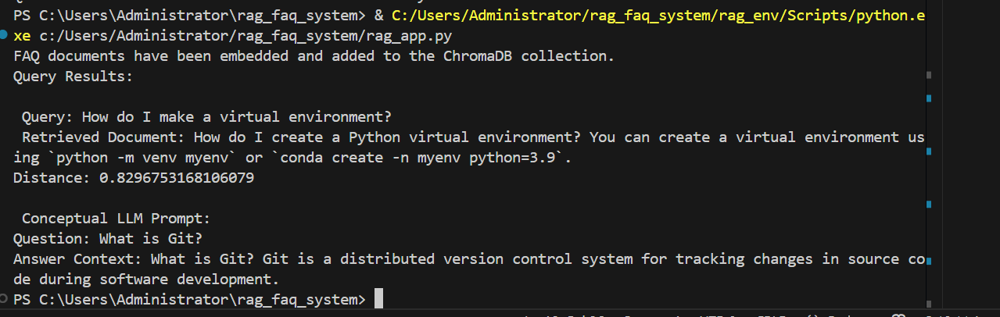
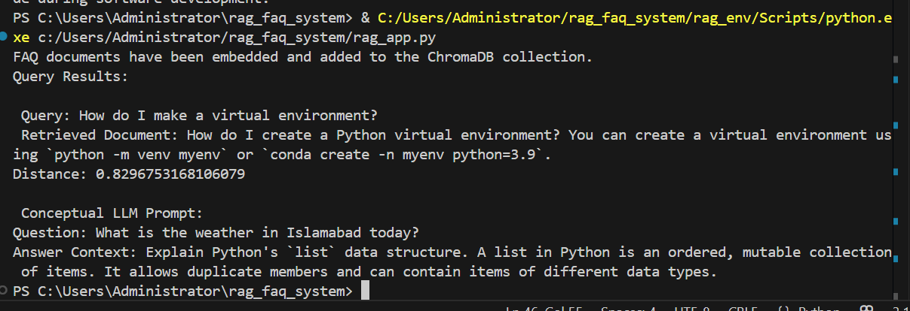

# 🧠 RAG FAQ System

This is a simple Retrieval-Augmented Generation (RAG) system that uses `ChromaDB`, `sentence-transformers`, and a local LLM to answer FAQs more accurately by retrieving semantically similar documents from a vector database.

---

## 🚀 Features

- Vector store powered by **ChromaDB**
- Embedding using `sentence-transformers` (e.g., `all-MiniLM-L6-v2`)
- Semantic search over your FAQ documents
- Shows **top 3 relevant results** with distances
- Augments LLM generation with retrieved context

---

## 🛠️ Installation

Install the required libraries:

```bash
pip install chromadb sentence-transformers transformers torch
```
📁 Project Structure

.
├── main.py                 # Main script to run the RAG pipeline
├── images/                 # Screenshots of results
│   ├── r-1.PNG             # Result for known question
│   ├── r-2.PNG             # Unseen query
│   └── r-3.PNG             # Top 3 results shown
├── requirements.txt        # Required packages
├── RAG_Exercise_Report.md  # Detailed documentation (to be created)
└── README.md

🔧 How It Works

Initialize ChromaDB:
Creates or loads a persistent vector store.

Embed Documents:

Your FAQ entries are embedded using a transformer model.

Add to DB:

Each embedded document is stored with metadata (e.g., ID).

Querying:
A user query is embedded and matched against stored vectors.

Top-k Retrieval:
The top 3 semantically closest documents are returned.

📝 Sample FAQ List

faq_documents = [
    "What is Git? Git is a distributed version control system for tracking changes in source code during software development.",
    "How do I create a Python virtual environment? You can create a virtual environment using `python -m venv myenv` or `conda create -n myenv python=3.9`.",
    "What is a FastAPI endpoint? A FastAPI endpoint is a function decorated with an HTTP method (like `@app.get` or `@app.post`) that handles incoming web requests.",
    "Explain Python's `list` data structure. A list in Python is an ordered, mutable collection of items. It allows duplicate members and can contain items of different data types."
]
❓ Example Queries & Results
✅ Closest Match Retrieval
Query: "How do I make a virtual environment?"
Result: Closest matching FAQ


 


🧠 Generalization to Unseen Query
Query: "How can I use GitHub for project collaboration?"
Result: Best semantically matched answer, even though not explicitly in the docs.


 


📚 Top 3 Results Retrieval
Query: "Explain Python's list data structure?"
Returns top 3 closest documents with distance scores.
 


💡 LLM Prompt Example

You are a helpful assistant. Answer the user’s question based on the following context:

Context:
- [Document 1]
- [Document 2]
- [Document 3]

User Question:
Conceptual LLM Prompt:
Question: Explain python's list data structure?


🧩 Challenges Faced
Choosing a light but accurate embedding model

Ensuring ChromaDB persistence for future use

Matching format for image embedding in markdown

Ensuring proper distance calculation and top-k selection

