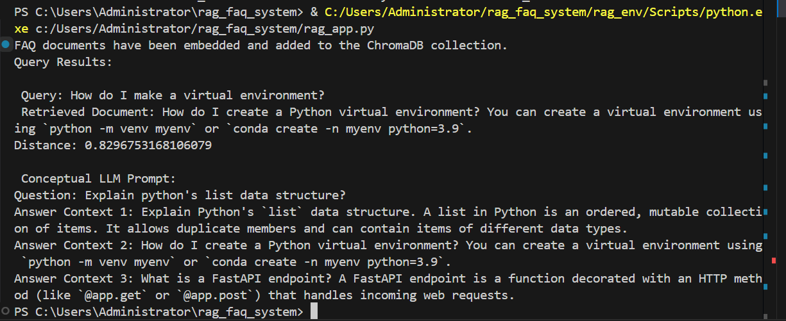

#  RAG FAQ System

This is a simple Retrieval-Augmented Generation (RAG) system that uses `ChromaDB`, `sentence-transformers`, and a local LLM to answer FAQs more accurately by retrieving semantically similar documents from a vector database.

---

##  Features

- Vector store powered by **ChromaDB**
- Embedding using `sentence-transformers` (e.g., `all-MiniLM-L6-v2`)
- Semantic search over your FAQ documents
- Shows **top 3 relevant results** with distances
- Augments LLM generation with retrieved context

---

##  Installation

Install the required libraries:

```bash
pip install chromadb sentence-transformers transformers torch
```
📁 Project Structure

.
├── main.py                 # Main script to run the RAG pipeline
├── images/                 # Screenshots of results
│   ├── r-1.PNG             # Result for known question
│   ├── r-2.PNG             # Unseen query
│   └── r-3.PNG             # Top 3 results shown
├── requirements.txt        # Required packages
├── RAG_Exercise_Report.md  # Detailed documentation (to be created)
└── README.md


---

##  Major Components Explained

- **Initializing ChromaDB**: Sets up a persistent vector store to save and retrieve document embeddings.
- **Loading the Embedding Model**: Uses `sentence-transformers` like `all-MiniLM-L6-v2` to turn both FAQs and queries into dense vector embeddings.
- **Embedding & Adding to DB**: Each document is transformed into a vector and stored with metadata for quick retrieval.
- **Querying**: The query is also embedded and compared with the stored vectors to find semantically similar documents.
- **Top-K Results**: Retrieves top 3 closest documents using cosine similarity and passes them to the LLM for answer generation.

## How It Works

Initialize ChromaDB:
Creates or loads a persistent vector store.

Embed Documents:

Your FAQ entries are embedded using a transformer model.

Add to DB:

Each embedded document is stored with metadata (e.g., ID).

Querying:
A user query is embedded and matched against stored vectors.

Top-k Retrieval:
The top 3 semantically closest documents are returned.

 Sample FAQ List

faq_documents = [
    "What is Git? Git is a distributed version control system for tracking changes in source code during software development.",
    "How do I create a Python virtual environment? You can create a virtual environment using `python -m venv myenv` or `conda create -n myenv python=3.9`.",
    "What is a FastAPI endpoint? A FastAPI endpoint is a function decorated with an HTTP method (like `@app.get` or `@app.post`) that handles incoming web requests.",
    "Explain Python's `list` data structure. A list in Python is an ordered, mutable collection of items. It allows duplicate members and can contain items of different data types."
]

 ## Example Queries & Results
 Closest Match Retrieval
Query: "How do I make a virtual environment?"
Result: Closest matching FAQ


 


 ## Generalization to Unseen Query
Query: "How can I use GitHub for project collaboration?"
Result: Best semantically matched answer, even though not explicitly in the docs.


 


 ## Top 3 Results Retrieval
Query: "Explain Python's list data structure?"
Returns top 3 closest documents 


 


## LLM Prompt Example

You are a helpful assistant. Answer the user’s question based on the following context:

Context:
- [Document 1]
- [Document 2]
- [Document 3]

User Question:
Conceptual LLM Prompt:
Question: Explain python's list data structure?

##  Why RAG is Better Than Standalone LLM

A standalone LLM might hallucinate or give generic responses when it lacks context. This simple RAG system ensures the model always has access to relevant information from your documents, grounding its responses in actual data. It improves both **accuracy** and **trustworthiness** of the generated answers.


## Challenges Faced
Choosing a light but accurate embedding model

Ensuring ChromaDB persistence for future use

Matching format for image embedding in markdown

Ensuring proper distance calculation and top-k selection

